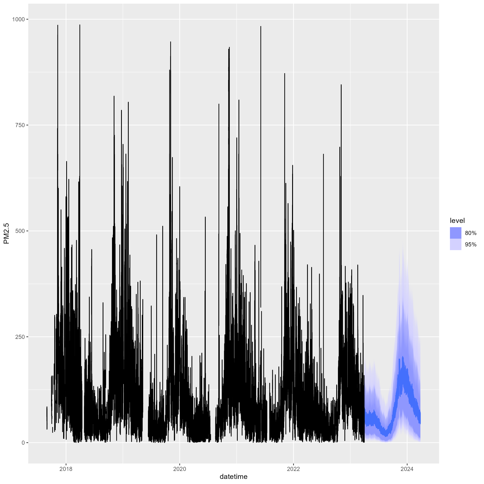
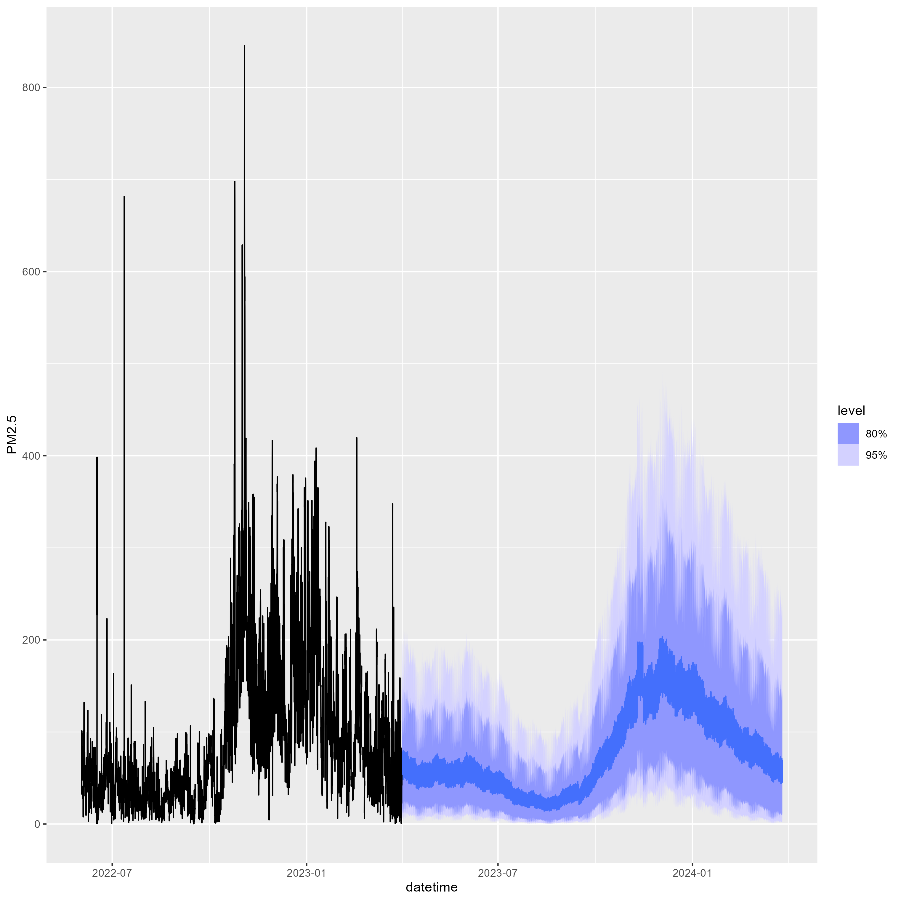

<!-- Directions: 
Conduct exploratory data analysis; visualize trends, seasonality, and stationarity tests. Visual and statistical exploration with a written summary. -->

# Packages
```{r setup}

library(fpp3) # Time Series Plots and Forecasting
library(corrplot) # Correlation Plot
library(forecast) # BoxCox Transformation
library(scales) # Log Scale Tick Lables
library(fable.prophet) # Prophet Model
set.seed(280)  # Reproducibility

```

# Setup 
<!-- Include Data Cleaning Steps? -->
### Read Data
```{r read_data}

data <- readRDS("../data/loaded/delhi_filter.rds")

df_monthly <- data %>%
  select(PM2.5) %>%
  index_by(month = yearmonth(datetime)) %>%
  summarise(PM2.5 = median(PM2.5, na.rm = TRUE))

df_weekly <- data %>%
  select(PM2.5) %>%
  index_by(week = yearweek(datetime)) %>%
  summarise(PM2.5 = median(PM2.5, na.rm = TRUE))

df_daily <- data %>%
  select(PM2.5) %>%
  index_by(date = as.Date(datetime)) %>%
  summarise(PM2.5 = median(PM2.5, na.rm = TRUE))

# Hourly
df <- data %>%
  select(PM2.5)

```


# Recomended Limit for PM2.5
```{r PM2.5_limts}

df_daily %>%
  autoplot(PM2.5) +
  geom_hline(yintercept = 35, color = "red", linetype = "dashed") +
  geom_hline(yintercept = 12, color = "blue", linetype = "dashed")

```

The World Health Organization recomends PM2.5 levels below $35ug/m^3$ for a daily average and below $12ug/m^3$ for a yearly average. The daily and yearly recomended levels are plotted in red and blue respectively. Only during the summer months are the PM2.5 levels below the WHO recomended daily limit.


# Seasonality

```{r seasonality}

gg_season(df, PM2.5, period = "1 year") +
  labs(title = "Yearly Seasonality")

gg_season(df, PM2.5, period = "1 month") +
  labs(title = "Monthly Seasonality")

gg_season(df, PM2.5, period = "1 week") +
  labs(title = "Weekly Seasonality")

gg_season(df, PM2.5, period = "1 day") +
  labs(title = "Daily Seasonality")

```


# Parameter Correlations

```{r correlation_matrix}

M <- cor(x = data[ , c(2:10)],
         y = data[ , c(2:10)],
         use = "na.or.complete")
corrplot(M)

```

High concentrations of CO, NO, NO2, NOx, PM2.5, and PM10 generally occur at the same time. High concentrations of Benzene, Toluene, and Xylene generally occur at the same time.


# PM2.5 as a Stationary Time Series
Setup Box-Cox transformations.  
```{r setup_lamda_values}

lambda_hourly_PM2.5 <- BoxCox.lambda(df$PM2.5)
lambda_daily_PM2.5 <- BoxCox.lambda(df_daily$PM2.5)
lambda_weekly_PM2.5 <- BoxCox.lambda(df_weekly$PM2.5)
lambda_monthly_PM2.5 <- BoxCox.lambda(df_monthly$PM2.5)

```

```{r stationarity}

# Log
df %>% 
  autoplot(difference(log(PM2.5), 24)) +
  labs(
    title = "Log Transformation Insufficient for Variance Stabilization"
  )

# Box-Cox
df %>%
  autoplot(difference(box_cox(PM2.5, lambda_hourly_PM2.5), 24)) +
    labs(
    title = "Box-Cox Transformation Shows Improved Variance Stabilization"
  )

```

Differencing PM2.5 centers the data.  Using a log transform does not quite alter the data into a stationary time series. However, using a Box-Cox transform does create a fairly stationary time series.


# Check for Constant Variance
```{r variance_check}

delhi_stat <- data.frame(logvar = numeric(10),
                         boxvar = numeric(10))
for (i in 1:10){
    delhi_stat[i,1] <- var(difference(log(df$PM2.5), 24)[
        floor(nrow(df)*0.1*(i-1)):floor(nrow(df)*0.1*i)
        ], na.rm = TRUE)

    delhi_stat[i,2] <- var(difference(box_cox(df$PM2.5, lambda_hourly_PM2.5), 24)[
        floor(nrow(df)*0.1*(i-1)):floor(nrow(df)*0.1*i)
    ], na.rm = TRUE)
}

```

```{r log_variance_plot}

plot(seq(1,10),delhi_stat$logvar, ylim = c(0,1))

```

The variance constantly changing even with log transformation.

```{r boxcox_variance_plot}

plot(seq(1,10),delhi_stat$boxvar, ylim = c(0,9))

```

The Box-Cox transformation results in decreasing but mostly stable variance.


# World Health Organization Recomended Limits:
CO: ≤9 ppm  
PM₂.₅: ≤15 µg/m³  
PM₁₀: ≤45 µg/m³  
NO₂: ≤25 µg/m³  
Benzene: As low as possible (<1 µg/m³)  
Toluene: ≤260 µg/m³  
Xylene: ≤870 µg/m³  


# Scaled Parameters by Recomended Limits
```{r scaled_boxplots}

df_scaled <- data %>%
  select(-NOx, -NO) %>%
  mutate(
    PM2.5 = PM2.5 / 15,
    PM10 = PM10 / 45,
    CO = CO / 9,
    NO2 = NO2 / 25,
    Benzene = Benzene / 1,
    Toluene = Toluene / 260,
    Xylene = Xylene / 870
  ) %>%
  pivot_longer(c(2:8))

ggplot(data = df_scaled) +
    aes(x = name, y = value, color = name) +
    geom_boxplot() +
    scale_y_log10(labels = label_number()) +
    theme(axis.text.x = element_text(angle = 45, vjust = 0.6)) +
    labs(
      x = NULL,
      y = "Multiple of Recomended Limit",
      title = "Air Quality Parameters by Recomended Limit"
    )
```

# Focus on PM2.5
The correlation plot previously showed that a high concentration of PM2.5 is linked to high concentrations of PM10, Nitrogen Oxides, and Carbon Monoxide. PM2.5 is also the greatest multiple above the recomended limit, shown in the prior boxplots. Additionally, PM2.5 is generally the most common measure of air quality. As such, focus will be given to PM2.5 for the remainder of this report.

### Effects on Air Quality in Delhi
The air quality in Delhi is majorly influenced by the Diwali festival and the burning season. The festival impacts air quality through increast vehicle polution and a significant number of fireworks. Additonally, farmers burn fields following harvest to improve next years crop, which contributes to the significant rise in PM2.5 concentrations before winter.

### Add Variables to Indicate the Diwali Festival and the Burning Season
```{r dummy_variables}

diwali_dates <- c(
  seq(as.Date("2017-10-16"), as.Date("2017-10-20"), by = "day"),
  seq(as.Date("2018-11-05"), as.Date("2018-11-09"), by = "day"),
  seq(as.Date("2019-10-25"), as.Date("2019-10-29"), by = "day"),
  seq(as.Date("2020-11-12"), as.Date("2020-11-16"), by = "day"),
  seq(as.Date("2021-11-02"), as.Date("2021-11-06"), by = "day"),
  seq(as.Date("2022-11-22"), as.Date("2022-11-26"), by = "day"),
  seq(as.Date("2023-11-10"), as.Date("2023-11-14"), by = "day"),
  seq(as.Date("2024-10-30"), as.Date("2024-11-03"), by = "day"),
  seq(as.Date("2025-10-18"), as.Date("2025-10-23"), by = "day")
)

burning_dates <- c(
  seq(as.Date("2017-9-15"), as.Date("2017-11-30"), by = "day"),
  seq(as.Date("2018-9-15"), as.Date("2018-11-30"), by = "day"),
  seq(as.Date("2019-9-15"), as.Date("2019-11-30"), by = "day"),
  seq(as.Date("2020-9-15"), as.Date("2020-11-30"), by = "day"),
  seq(as.Date("2021-9-15"), as.Date("2021-11-30"), by = "day"),
  seq(as.Date("2022-9-15"), as.Date("2022-11-30"), by = "day"),
  seq(as.Date("2023-9-15"), as.Date("2023-11-30"), by = "day"),
  seq(as.Date("2024-9-15"), as.Date("2024-11-30"), by = "day"),
  seq(as.Date("2025-9-15"), as.Date("2025-11-30"), by = "day")
)

df <- df %>%
  mutate(
    is_diwali = as.integer(as.Date(datetime) %in% diwali_dates),
    is_burning_season = as.integer(as.Date(datetime) %in% burning_dates)
  )

df %>%
  autoplot(PM2.5) +
  autolayer(filter(df, as.Date(datetime) %in% diwali_dates), color = "red")

df %>%
  autoplot(PM2.5) +
  autolayer(filter(df, as.Date(datetime) %in% burning_dates), color = "red")

```

# Prophet Model

```{r prophet_no_transform, eval = FALSE} 

fit <- df %>%
  model(
    prophet(box_cox(PM2.5, lambda_hourly_PM2.5) ~ is_diwali + is_burning_season +
        season(period = "day", order = 10) +
        season(period = "week", order = 5) +
        season(period = "month", order = 3) +
        season(period = "year", order = 3)
    )
  )

new_data <- df %>%
  new_data(n = 24 * 30 * 12) %>%  # About 1 year to forecast
  mutate(
    is_diwali = as.integer(as.Date(datetime) %in% diwali_dates),
    is_burning_season = as.integer(as.Date(datetime) %in% burning_dates)
  )

fc <- forecast(fit, new_data = new_data)
autoplot(fc, df)
autoplot(fc, filter(df, as.Date(datetime) > as.Date("2022-06-01")))

```





# Weekly ARIMIA with Fouier - Interpolation and STL Decomposition

```{r weekly_ARIMA_fc}
# Optimize K:
# K_candidates <- 1:22
# results <- data.frame(K = numeric(), AICc = numeric())
# for (K in K_candidates) {
#   fit <- df_weekly %>%
#     model(ARIMA(box_cox(PM2.5, lambda_weekly_PM2.5) ~ fourier(K = K)))
#   data <- data.frame(K = K, AICc = glance(fit)$AICc)
#   results <- bind_rows(results, data)
# }
# results %>%
#   filter(AICc == min(results$AICc))
# K = 7 was best with an AICc of 230.221

fit <- readRDS("../models/weekly_fit_ARIMA(4,0,0)(1,0,0)[52].rds")
# fit <- df_weekly %>%
#   model(ARIMA(box_cox(PM2.5, lambda_weekly_PM2.5) ~ fourier(K = 7)))

fc <- forecast(fit, h = 104)
autoplot(fc, df_weekly)

```

```{r ARIMA_plot}

df_weekly %>%
  autoplot(PM2.5) +
  autolayer(fitted(fit), .fitted, color = "red")

```
The ARIMA fit with K = 7 fourier terms looks decent. It will be used to interpolate the weekly data for an STL decomposition.

```{r weekly_ARIMA_interpolation}

df_weekly_filled <- interpolate(fit, df_weekly)

df_weekly_filled %>%
  autoplot(PM2.5) +
  labs(
    title = "PM2.5 Interpolated Weekly Series"
  )
```


### STL Decomposition
```{r STL_decomposition}
dc <- df_weekly_filled %>%
  model(STL(PM2.5 ~ trend(window = 104) + season(window = "periodic")))

components(dc) %>%
  autoplot() +
  labs(
    title = "STL Decomposition Componenets"
  )

```

Decreasing trend is promising indicating a drop of around $30ug/m^3$ over 7 years. However, the average level of particulates is still far above the recomended level.  

# What's Next?
Test/Train set? (prophet doesn't have a glance() option so comparing it with other modesl will require this).  

Optimize K for ARIMA at hourly level? Will take awhile...  

Clean commented code (one method that works is to put the commented code in a block that has eval = FALSE and the readRDS portion in a code block that has echo = FALSE).


