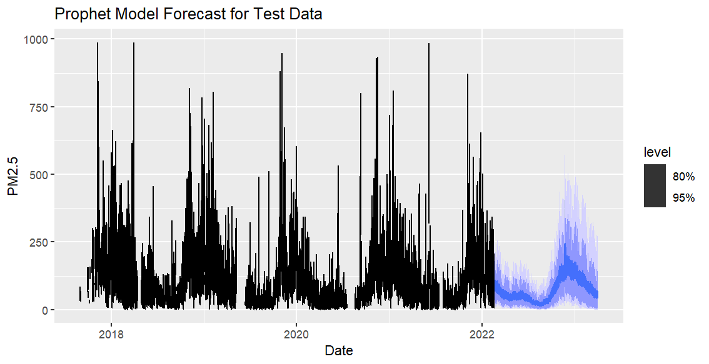
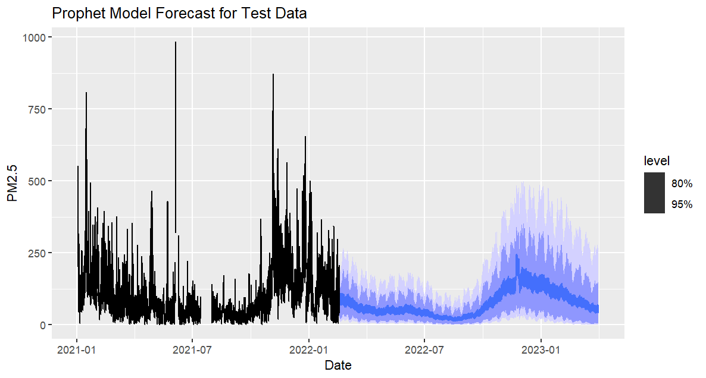
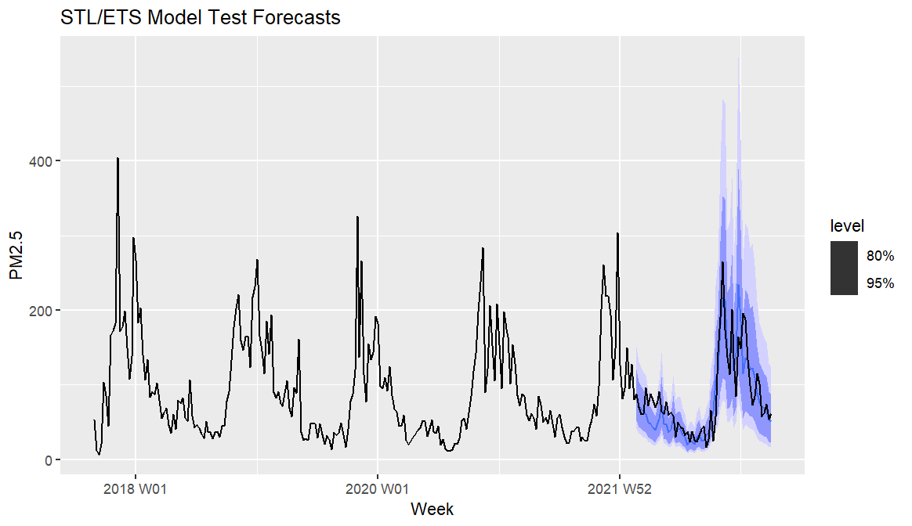
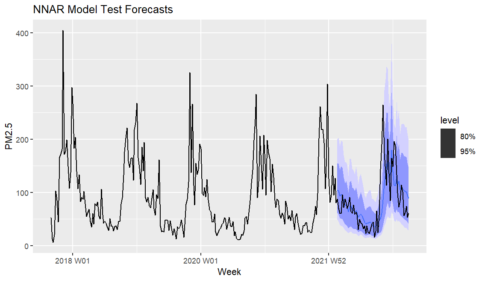
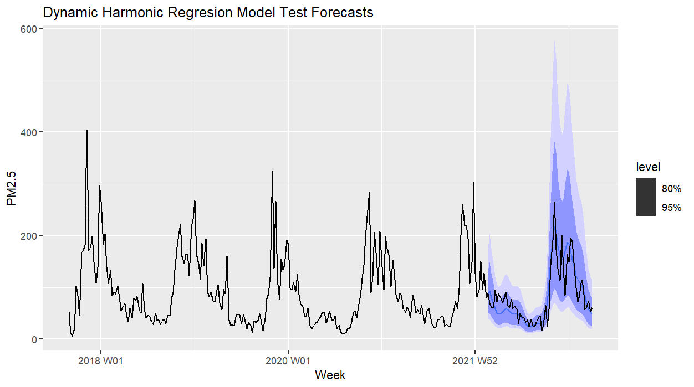
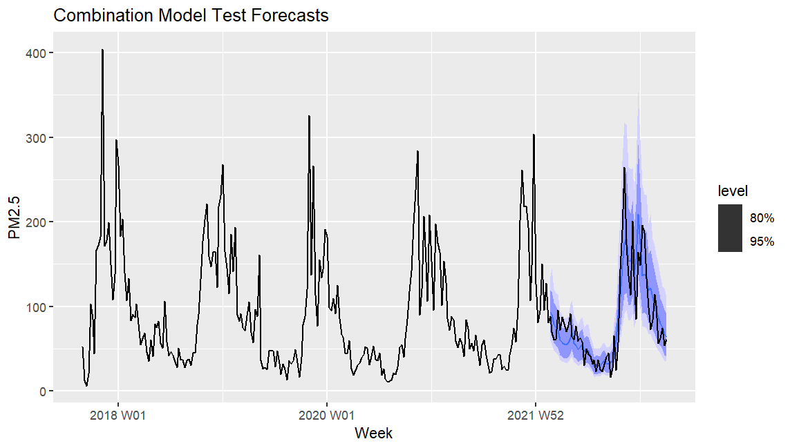
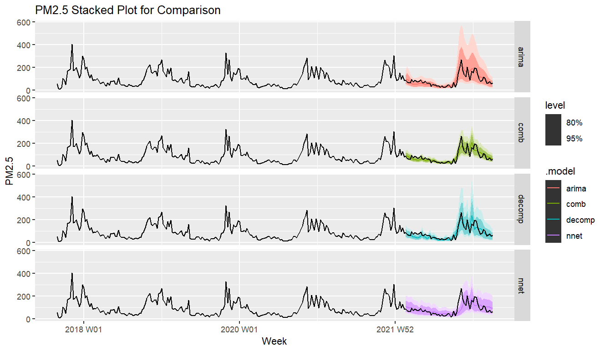
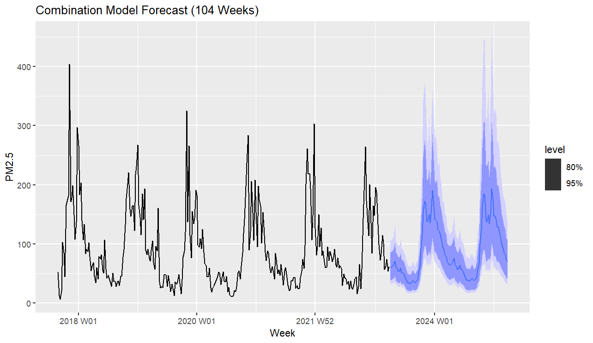

<!-- Directions: 
Conduct exploratory data analysis; visualize trends, seasonality, and stationarity tests. Visual and statistical exploration with a written summary. -->

# Packages
```{r setup}

library(fpp3) # Time Series Plots and Forecasting
library(corrplot) # Correlation Plot
library(forecast) # BoxCox Transformation
library(scales) # Log Scale Tick Lables
library(fable.prophet) # Prophet Model
set.seed(280)  # Reproducibility

```

# Setup 
<!-- Include Data Cleaning Steps? -->
### Read Data
```{r read_data}

data <- readRDS("../data/loaded/delhi_filter.rds")

df_monthly <- data %>%
  select(PM2.5) %>%
  index_by(month = yearmonth(datetime)) %>%
  summarise(PM2.5 = median(PM2.5, na.rm = TRUE))

df_weekly <- data %>%
  select(PM2.5) %>%
  index_by(week = yearweek(datetime)) %>%
  summarise(PM2.5 = median(PM2.5, na.rm = TRUE))

df_daily <- data %>%
  select(PM2.5) %>%
  index_by(date = as.Date(datetime)) %>%
  summarise(PM2.5 = median(PM2.5, na.rm = TRUE))

# Hourly
df <- data %>%
  select(PM2.5)

```


# Recomended Limit for PM2.5
```{r PM2.5_limts}

df_daily %>%
  autoplot(PM2.5) +
  geom_hline(mapping = aes(yintercept = 35, color = "Yearly Avg."), linetype = "dashed") +
  geom_hline(mapping = aes(yintercept = 12, color = "Daily Avg."), linetype = "dashed")+
  labs(x = "Date", title = "Comparison of Air Quality to WHO Recommendations")+
  scale_color_manual(name = "WHO Recommendations",
                     values = c("Yearly Avg." = "blue", "Daily Avg." = "red"))+
  theme(legend.position = "bottom")

```

The World Health Organization recommends PM2.5 levels below $35ug/m^3$ for a daily average and below $12ug/m^3$ for a yearly average. The daily and yearly recommended levels are plotted in red and blue respectively. Only during the summer months are the PM2.5 levels below the WHO recommended daily limit.


# Seasonality

```{r seasonality}

gg_season(df, PM2.5, period = "1 year") +
  labs(x = "Month", title = "Yearly Seasonality")

gg_season(df, PM2.5, period = "1 month") +
  labs(x = "Week",title = "Monthly Seasonality")

gg_season(df, PM2.5, period = "1 week") +
  labs(x = "Day", title = "Weekly Seasonality")+
  theme(axis.text.x = element_text(angle = 45, vjust = 0.75))

gg_season(df, PM2.5, period = "1 day") +
  labs(x = "Hour", title = "Daily Seasonality")

```


# Parameter Correlations

```{r correlation_matrix}

M <- cor(x = data[ , c(2:10)],
         y = data[ , c(2:10)],
         use = "na.or.complete")
corrplot(M)

```

High concentrations of CO, NO, NO2, NOx, PM2.5, and PM10 generally occur at the same time. High concentrations of Benzene, Toluene, and Xylene generally occur at the same time. It is logical to believe that these chemicals would have similar sources of emission in either case.


# PM2.5 as a Stationary Time Series

The following code generates the proper $\lambda$ parameters for Box-Cox transformations.  

```{r setup_lamda_values}

lambda_hourly_PM2.5 <- BoxCox.lambda(df$PM2.5)
lambda_daily_PM2.5 <- BoxCox.lambda(df_daily$PM2.5)
lambda_weekly_PM2.5 <- BoxCox.lambda(df_weekly$PM2.5)
lambda_monthly_PM2.5 <- BoxCox.lambda(df_monthly$PM2.5)

```

```{r stationarity}

# Log
df %>% 
  autoplot(difference(log(PM2.5), 24)) +
  labs(
    title = "Log Transformation of Differenced PM2.5",
    y = "Log Transformed Values"
  )

# Box-Cox
df %>%
  autoplot(difference(box_cox(PM2.5, lambda_hourly_PM2.5), 24)) +
    labs(
    title = "Box-Cox Transformation of Differenced PM2.5",
    y = "Box-Cox Transformed Values"
  )

```

Differencing PM2.5 centers the data.  Using a log transform does not quite alter the data into a stationary time series. However, using a Box-Cox transform does create a fairly stationary time series, allowing for the application of ARIMA models for forecasting and interpolation purposes.


# Check for Constant Variance
```{r variance_check}

delhi_stat <- data.frame(logvar = numeric(10),
                         boxvar = numeric(10))
for (i in 1:10){
    delhi_stat[i,1] <- var(difference(log(df$PM2.5), 24)[
        floor(nrow(df)*0.1*(i-1)):floor(nrow(df)*0.1*i)
        ], na.rm = TRUE)

    delhi_stat[i,2] <- var(difference(box_cox(df$PM2.5, lambda_hourly_PM2.5), 24)[
        floor(nrow(df)*0.1*(i-1)):floor(nrow(df)*0.1*i)
    ], na.rm = TRUE)
}

```

```{r log_variance_plot}

plot(seq(1,10),
     delhi_stat$logvar, 
     ylim = c(0,1), 
     xlab = "Date Decile",
     ylab = "Variance",
     main = "Variance of Log Transformed PM2.5")

```

The variance constantly changing even with log transformation.

```{r boxcox_variance_plot}

plot(seq(1,10),delhi_stat$boxvar, 
     ylim = c(0,9),
     xlab = "Date Decile",
     ylab = "Variance",
     main = "Variance of Box-Cox Transformed PM2.5")

```

The Box-Cox transformation results in decreasing but mostly stable variance.


# World Health Organization Recomended Limits:
CO: ≤9 ppm  
PM₂.₅: ≤15 µg/m³  
PM₁₀: ≤45 µg/m³  
NO₂: ≤25 µg/m³  
Benzene: As low as possible (<1 µg/m³)  
Toluene: ≤260 µg/m³  
Xylene: ≤870 µg/m³  


# Scaled Parameters by Recomended Limits
```{r scaled_boxplots}

df_scaled <- data %>%
  select(-NOx, -NO) %>%
  mutate(
    PM2.5 = PM2.5 / 15,
    PM10 = PM10 / 45,
    CO = CO / 9,
    NO2 = NO2 / 25,
    Benzene = Benzene / 1,
    Toluene = Toluene / 260,
    Xylene = Xylene / 870
  ) %>%
  pivot_longer(c(2:8))

ggplot(data = df_scaled) +
    aes(x = name, y = value, color = name) +
    geom_boxplot() +
    scale_y_log10(labels = label_number()) +
    theme(axis.text.x = element_text(angle = 45, vjust = 0.6)) +
    labs(
      x = NULL,
      y = "Multiple of Recomended Limit",
      title = "Air Quality Parameters by Recomended Limit"
    )
```

# Focus on PM2.5
The correlation plot previously showed that a high concentration of PM2.5 is linked to high concentrations of PM10, Nitrogen Oxides, and Carbon Monoxide. PM2.5 is also the greatest multiple above the recommended limit, shown in the prior boxplots. Additionally, PM2.5 is generally the most common measure of air quality. As such, focus will be given to PM2.5 for the remainder of this report.

### Effects on Air Quality in Delhi
The air quality in Delhi is majorly influenced by the Diwali festival and the burning season. The festival impacts air quality through increased vehicle pollution and a significant number of fireworks. Additionally, farmers burn fields following harvest to improve next years crop, which contributes to the significant rise in PM2.5 concentrations before winter.

### Add Variables to Indicate the Diwali Festival and the Burning Season
```{r dummy_variables}

diwali_dates <- c(
  seq(as.Date("2017-10-16"), as.Date("2017-10-20"), by = "day"),
  seq(as.Date("2018-11-05"), as.Date("2018-11-09"), by = "day"),
  seq(as.Date("2019-10-25"), as.Date("2019-10-29"), by = "day"),
  seq(as.Date("2020-11-12"), as.Date("2020-11-16"), by = "day"),
  seq(as.Date("2021-11-02"), as.Date("2021-11-06"), by = "day"),
  seq(as.Date("2022-11-22"), as.Date("2022-11-26"), by = "day"),
  seq(as.Date("2023-11-10"), as.Date("2023-11-14"), by = "day"),
  seq(as.Date("2024-10-30"), as.Date("2024-11-03"), by = "day"),
  seq(as.Date("2025-10-18"), as.Date("2025-10-23"), by = "day")
)

burning_dates <- c(
  seq(as.Date("2017-9-15"), as.Date("2017-11-30"), by = "day"),
  seq(as.Date("2018-9-15"), as.Date("2018-11-30"), by = "day"),
  seq(as.Date("2019-9-15"), as.Date("2019-11-30"), by = "day"),
  seq(as.Date("2020-9-15"), as.Date("2020-11-30"), by = "day"),
  seq(as.Date("2021-9-15"), as.Date("2021-11-30"), by = "day"),
  seq(as.Date("2022-9-15"), as.Date("2022-11-30"), by = "day"),
  seq(as.Date("2023-9-15"), as.Date("2023-11-30"), by = "day"),
  seq(as.Date("2024-9-15"), as.Date("2024-11-30"), by = "day"),
  seq(as.Date("2025-9-15"), as.Date("2025-11-30"), by = "day")
)

df <- df %>%
  mutate(
    is_diwali = as.integer(as.Date(datetime) %in% diwali_dates),
    is_burning_season = as.integer(as.Date(datetime) %in% burning_dates)
  )

df %>%
  autoplot(PM2.5) +
  autolayer(filter(df, as.Date(datetime) %in% diwali_dates), color = "red")+
  labs(x = "Date", title = "Highlighted Diwali Season")

df %>%
  autoplot(PM2.5) +
  autolayer(filter(df, as.Date(datetime) %in% burning_dates), color = "red")+
  labs(x = "Date", title = "Highlighted Burning Season")

```

# Prophet Model

**Note:** All modeling beyond this point will use a train/test structure with 80% of the data used as training data and 20% used as test data.

```{r prophet_model, eval = FALSE}

df_hour_train <- df[1:floor(0.8*nrow(df)),]
df_hour_test <- df[ceiling(0.8*nrow(df)):nrow(df),]

prophet_lambda <- BoxCox.lambda(df_hour_train$PM2.5)

fit <- df_hour_train %>%
  model(
    prophet(box_cox(PM2.5, prophet_lambda) ~ is_diwali + is_burning_season +
        season(period = "day", order = 10) +
        season(period = "week", order = 5) +
        season(period = "month", order = 3) +
        season(period = "year", order = 3)
    )
  )

new_data <- df %>%
  new_data(n = 9788) %>%  # About 1 year to forecast
  mutate(
    is_diwali = as.integer(as.Date(datetime) %in% diwali_dates),
    is_burning_season = as.integer(as.Date(datetime) %in% burning_dates)
  )

```

```{r load_model_fc, echo=FALSE}

fit <- readRDS("../models/hourly_fit_prophet_trained.rds")

```

```{r prop_accuracy}

accuracy(fit)
```

The Prophet model for hourly data has a very high RMSE and MAPE. The Mean Absolute Percent Error is ~96%, which is exceptionally high. This model is likely not the best fit for the data.

```{r prophet_no_transform, eval = FALSE} 

fc <- forecast(fit, df_hour_test)

autoplot(fc, df_hour_train)+
  labs(x = "Date", title = "Prophet Model Forecast for Test Data")
autoplot(fc, filter(df_hour_train, as.Date(datetime) > as.Date("2021-01-01")))+
    labs(x = "Date", title = "Prophet Model Forecast for Test Data")

```




Looking at the forecasts of the Prophet model, we can see why this model has such large error diagnostics. During the Diwali/Burning season, the Prophet model largely underestimates the PM2.5 values. In addition, the point estimates do not have nearly as much variation compared to the actual values of the data, which would also lead to more occurences of under/over-estimating, even outside of the burning season.

Due to this behavior, an hourly Prophet model is likely not the best choice and can only really serve (visually) as a trend estimate for India's PM2.5 levels.

# Weekly ARIMA with Fourier - Interpolation and STL Decomposition

We now divert to the generation of models using the weekly aggregated data, as many model types would not give meaningful results on the hourly level.

Due to many model types, such as STL and ETS, not being able to handle missing values, we first interpolate these missing values using a Dynamic Harmonic Regression (DHR) model.

```{r weekly_train}
df_week_train <- df_weekly[1:floor(0.8*nrow(df_weekly)),]
df_week_test <- df_weekly[ceiling(0.8*nrow(df_weekly)):nrow(df_weekly),]

```

The following code optimizes the number of Fourier terms for a Dynamic Harmonic Regression model.

```{r weekly_ARIMA_fit, eval=FALSE}

#Optimize K:
K_candidates <- 1:22
results <- data.frame(K = numeric(), AICc = numeric())
for (K in K_candidates) {
  fit <- df_weekly %>%
    model(ARIMA(box_cox(PM2.5, lambda_weekly_PM2.5) ~ fourier(K = K)))
  data <- data.frame(K = K, AICc = glance(fit)$AICc)
  results <- bind_rows(results, data)
}
results %>%
  filter(AICc == min(results$AICc))
# K = 7 was best with an AICc of 230.221

fit <- df_weekly %>%
  model(ARIMA(box_cox(PM2.5, lambda_weekly_PM2.5) ~ fourier(K = 7)))

```

The optimized model was a DHR model with `K = 7`.

```{r weekly_ARIMA_fc}

fit <- readRDS("../models/weekly_fit_ARIMA(4,0,0)(1,0,0)[52].rds")

report(fit)

accuracy(fit)

```

```{r ARIMA_plot}

df_weekly %>%
  autoplot(PM2.5) +
  autolayer(fitted(fit), .fitted, color = "red")+
  labs(x = "Date", title = "Fitted Values of ARIMA Interpolation Model")

```

The DHR/ARIMA fit with K = 7 fourier terms looks decent. It will be used to interpolate the weekly data for an STL decomposition and further modeling.

```{r weekly_ARIMA_interpolation}

df_weekly_filled <- interpolate(fit, df_weekly)

df_weekly_filled %>%
  autoplot(PM2.5) +
  labs(
    title = "PM2.5 Interpolated Weekly Series",
    x = "Date"
  )
```


# STL Decomposition

```{r STL_decomposition}

dc <- df_weekly_filled %>%
  model(STL(PM2.5 ~ trend(window = 104) + season(window = "periodic")))

components(dc) %>%
  autoplot() +
  labs(
    title = "STL Decomposition Componenets"
  )

```

Decreasing trend is promising indicating a drop of around $30ug/m^3$ over 7 years. However, the average level of particulates is still far above the recomended level.  

# STL/ETS, ARIMA, Neural Net, and Combination Models

```{r split_filled}

df_filled_train <- df_weekly_filled[1:floor(0.8*nrow(df_weekly_filled)),]
df_filled_test <- df_weekly_filled[ceiling(0.8*nrow(df_weekly_filled)):nrow(df_weekly_filled),]

lambda_week_train <- BoxCox.lambda(df_week_train$PM2.5)
```

```{r opt_filled_ARIMA, eval = FALSE}

K_candidates <- 1:22
results <- data.frame(K = numeric(), AICc = numeric())

for (K in K_candidates) {
  fit <- df_filled_train %>%
    model(ARIMA(box_cox(PM2.5, lambda_week_train) ~ fourier(K = K)))
  data <- data.frame(K = K, AICc = glance(fit)$AICc)
  results <- bind_rows(results, data)
}
results %>%
  filter(AICc == min(results$AICc))
# K = 6 was best with an AICc of -74.51495
```

Optimizing `K` as a fourier term reveals that the best parameter is `K = 6`

``` {r weekly_models, eval = FALSE}

# log transform to constrain above 0
decomp <- decomposition_model(
    STL(log(PM2.5) ~ trend(window = 104) + season(window = "periodic")),
    ETS(season_adjust ~ season("N"))
)

weekly_fit <- df_filled_train |>
  model(decomp = decomp,
        nnet = NNETAR(box_cox(PM2.5, BoxCox.lambda(df_filled_train$PM2.5))),
        arima = ARIMA(box_cox(PM2.5, lambda_week_train) ~ fourier(K = 6)))|>
  mutate(comb = (decomp + nnet + arima) / 3)


```

```{r load_comb_model, echo = FALSE}
weekly_fit <- readRDS("../models/weekly_fit_combination.rds")
```

```{r report_comb}

report(weekly_fit$decomp[[1]])
report(weekly_fit$nnet[[1]])
report(weekly_fit$arima[[1]])

```


The STL/ETS decomposition model was set to predict `log(PM2.5)` to constrain predictions to positive values. This yielded an `ETS(A,N,N)` model with parameters $\alpha=0.1590716,\ell_0=4.102751$ for the seasonally adjusted data.

The NNAR model yielded a neural network with 3 lagged inputs, 1 yearly seasonal lagged input, and 2 nodes in the hidden layer.

The Dynamic Harmonic Regression model produced a linear model with `ARIMA(0,1,2)(1,0,0)[52]` errors. This indicates that the errors have 1 first order difference, a second order moving average component, and a first order seasonal (yearly) autoregressive component.

We will forecast each of these models for the 20% testing data that we had segmented above. This is a total of 59 weeks. The combination model will not have prediction intervals by default, so we use the `generate()` function to bootstrap 1000 sample paths into prediction intervals.

```{r weekly_forecasts, eval = FALSE}

weekly_fc <- weekly_fit |>
    forecast(h=59)

futures <- weekly_fit[,4] |>
  # Generate 1000 future sample paths
  generate(h = 59, times = 1000) |>
  group_by(.model) |>
  summarise(
    dist = distributional::dist_sample(list(.sim))
  ) |>
  ungroup() |>
  # Create fable object
  as_fable(index = week, key = .model,
           distribution = dist, response = "PM2.5")

# Add intervals to comb forecast
weekly_fc$PM2.5[which(weekly_fc$.model=="comb")] <- futures$dist

```

```{r STL_Plot, eval=FALSE}
weekly_fc |> filter(.model == "decomp") |>
    autoplot(df_weekly_filled)+
    labs(x = "Week", title = "STL/ETS Model Test Forecasts")
```



```{r NNET_Plot, eval=FALSE}

weekly_fc |> filter(.model == "nnet") |>
    autoplot(df_weekly_filled)+
    labs(x = "Week", title = "NNAR Model Test Forecasts")
```



```{r ARIMA_Plot, eval=FALSE}

weekly_fc |> filter(.model == "arima") |>
    autoplot(df_weekly_filled)+
    labs(x = "Week", title = "Dynamic Harmonic Regresion Model Test Forecasts")
```



```{r comb_plot, eval=FALSE}
weekly_fc |> filter(.model == "comb") |>
    autoplot(df_weekly_filled)+
    labs(x = "Week", title = "Combination Model Test Forecasts")

```



```{r joint_plot, eval = FALSE}
weekly_fc |> autoplot(df_weekly_filled)+
    facet_grid(rows = vars(.model)) +
    labs(x = "Week", title = "PM2.5 Stacked Plot for Comparison")
```



### Model Evaluation

Visually, the STL/ETS and Combination models follow the test data the closest in their forecasts compared to the remaining models. The DHR/ARIMA model has very wide prediction interval, so it may be slightly less useful, as we are less certain that the real values will be closer to the point estimates. The Neural Net model is less optimal due to a few of the test data falling outside of even the 95% prediction intervals.

We can evaluate the performance of these models and their prediction intervals below. For the evaluation of distributional forecasts, we use the Continuous Ranked Probability Score (CRPS).

```{r crps, eval = FALSE}

weekly_fc |>
  accuracy(df_filled_test, list(crps = CRPS))
```

```{r read_crps, echo = FALSE}

crps <- readRDS("../tables/crps_table_comb.rds")
crps
```

We see from these CRPS values that the Combination model has the lowest score, and thus gives the best distributional forecasts out of the 4 models. The DHR model's distributional forecasts are far worse than the rest, as it has a **significantly** higher CRPS.

```{r acc, eval = FALSE}

weekly_fc |> accuracy(df_weekly_filled) |> select(.model, RMSE, MAPE)
```

```{r read_acc, echo = FALSE}

acc <- readRDS("../tables/acc_table_comb.rds")
acc |> select(.model, RMSE, MAPE)
```

Using RMSE and MAPE as error evaluation metrics, it is clear that the DHR and Combination forecasts perform the best out of the 4 models. The Combination model has an RMSE that is higher than the DHR model, but only marginally so. However, the Combination model's average absolute percent error is ~2% less that that of the DHR model, which is a notable difference.

Since the Combination model has similar or lower error to the DHR model but **significantly** better distributional forecasts, it is recommended to utilize the Combination model for proper forecasting.

# Forecasting Into the Future

Now that we have chosen a model for proper forecasting, we aim to forecast 104 weeks (roughly 2 years) into the future and report on changes in the quality of Delhi's air.

```{r new_forecast, eval=FALSE}

new_data <- df_filled_train %>%
    new_data(n = 59+104)

new_fc <- weekly_fit$comb[[1]] |>
    forecast(new_data = new_data)

new_futures <- weekly_fit[,4] |>
  # Generate 1000 future sample paths
  generate(h = 59+104, times = 1000) |>
  group_by(.model) |>
  summarise(
    dist = distributional::dist_sample(list(.sim))
  ) |>
  ungroup() |>
  # Create fable object
  as_fable(index = week, key = .model,
           distribution = dist, response = "PM2.5")

new_fc$PM2.5 <- new_futures$dist

new_fc <- new_fc |> filter(week > df_filled_test$week[59])

new_fc |> autoplot(df_weekly_filled)+
    labs(x = "Week", title = "Combination Model Forecast (104 Weeks)")

```



## Conclusions

From the forecasts above, we can determine the following:

 * Delhi, India is projected to see a decrease in PM2.5 air pollution within the next 2 years, based on point estimates
   * The distributional forecasts still allow for a potential increase in PM2.5 air pollutants
 
 * The lowest estimate of PM2.5 quantities will occur in Week 32 of 2023 (August).
   * Estimate: 33.15853 $\mu g$/$m^3$
 
 * The highest estimate of PM2.5 quantities will occur on Week 51 of 2023 (December).
   * Estimate: 189.5962 $\mu g$/$m^3$

